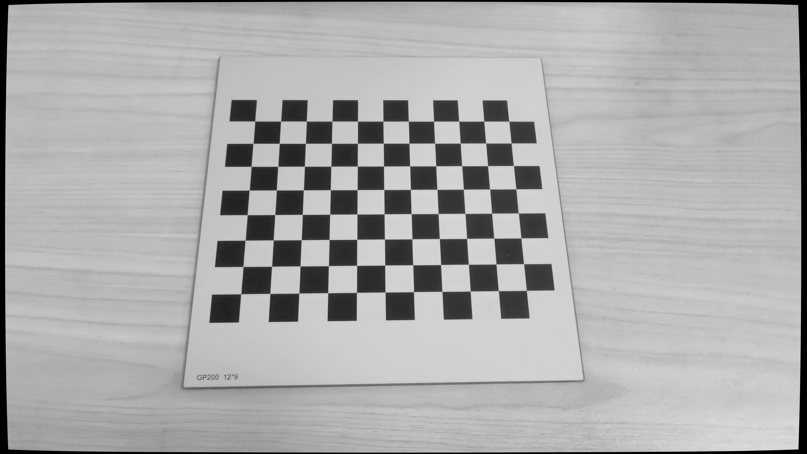
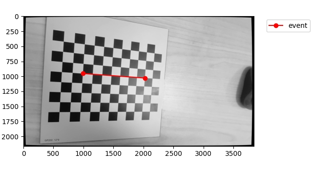

# Single Camera Measurement

*[中文](README_zh.md)*

## Introduction

Nowadays, the camera function of mobile phones allows us to easily obtain photos. Although most people do not use cameras for measurement, it is actually a very practical method in engineering practice. The monocular vision measurement technique introduced here allows us to conveniently use mobile phones to measure a specific plane.

This project is based on the `OpenCV` library and implements monocular vision measurement through the following three steps:

1. Camera intrinsic calibration using a chessboard grid;
2. Obtaining camera extrinsic parameters using a chessboard grid (depending on the actual scenario, different methods can be chosen for extrinsic calibration);
3. Select a line segment on the picture taken in step 2, the program will display the size of this line segment in the real world.

## Usage

### Step One: Intrinsic Calibration

1. Take pictures of the chessboard grid from different angles with the camera, and then put the pictures into the `train` folder.
2. Modify `chess_size`, `grid_length`, and `image_size` in the `data/Calibration.toml` file. Where, `chess_size` is the number of squares on the chessboard grid, `grid_length` is the size of each square (in `mm`), and `image_size` is the size of the image.
3. Run the `train-intrinsic.py` script. The resulting intrinsic parameters will be saved in the `data/Calibration.toml` file.
4. After the intrinsic calibration is completed, you can view the undistorted image in the `undistort-img` folder. As shown in the figure below:



### Step Two: Extrinsic Calibration

Put a picture containing a chessboard grid in the `test` folder. The `measure-test.py` script shows how to perform extrinsic calibration. In this process, it also extracts the corners of the chessboard grid, transforms them into the world coordinate system, and then compares them with the known world coordinates of the chessboard grid to verify the effectiveness of the method.

### Step Three: Measurement

The `measure.py` script is used for actual measurement. You can select a picture in this script, then choose the start point and end point, the program will calculate and display the distance between these two points.



```bash
Distance: 
[105.12268]
```
